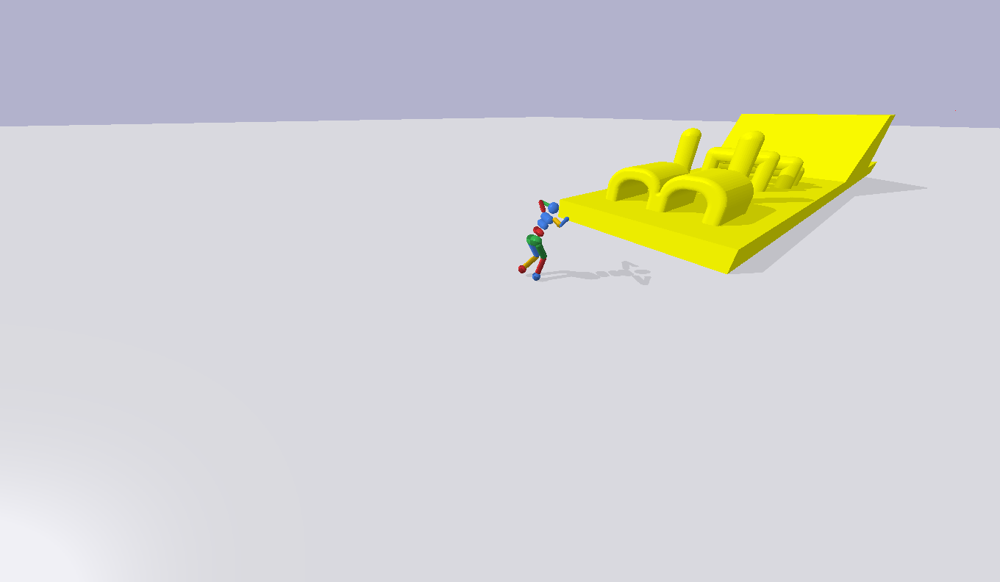

# parkour-training



## Installing gym_parkour
```bash
git clone https://github.com/Roboy/parkour-training
cd parkour-training
pip install -e .
```

## Examples
Watch pretrained humanoid failing on the parkour track
```bash
cd parkour-training
python3 enjoy_humanoid
```

## Environments
ParkourChallenge-v0


## Bugs
pbullet migth throw an error if several environments run in parallel:
pybullet.error: Not connected to physics server.

for fix see here: pybullet.error: Not connected to physics server.
